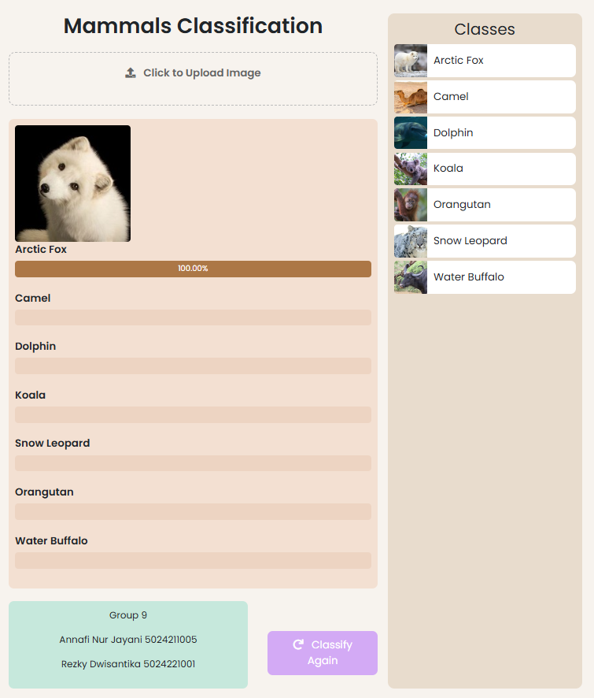

# 🦒 myMammals: A Simple Mammal Classification Website  

**myMammals** is a lightweight and straightforward website that demonstrates the use of a simple machine learning model to classify images into **7 mammal categories**. The project combines basic deep learning with a user-friendly web interface built using **HTML, CSS, JavaScript**, and **Bootstrap**.

---

## 🌟 **Features**  
- **7 Mammal Classes**: The model can classify images into these categories:  
  **Arctic Fox, Camel, Dolphin, Koala, Orangutan, Snow Leopard, Water Buffalo**.  
- **Simple Architecture**: A custom **Convolutional Neural Network (CNN)** is used for the model.  
- **Data Augmentation**: Boosts model performance by generating diverse training data.  
- **Interactive Web Interface**: Upload an image and see the classification results instantly!  

---

## 🛠️ **Workflow Overview**  
1. **Model Development**:  
   - The model is built in **PyTorch**.  
   - It is converted from PyTorch → **ONNX** → **TensorFlow** → **TensorFlow.js** for web deployment.  

2. **Dataset**:  
   - The dataset is sourced from [Kaggle](https://www.kaggle.com/datasets/asaniczka/mammals-image-classification-dataset-45-animals).  
   - Only **7 classes** are selected, with **250 images per class**.  
   - Images are split into **training, validation, and testing sets** in an **8:1:1 ratio**.  

3. **Web Development**:  
   - Built using **HTML, CSS, JavaScript**, and styled with **Bootstrap**.  

---

## 📂 **Repositories and Links**  
- **Website Repository**: [GitHub - myMammals](https://github.com/quilaxy/myMammals.git)  
- **Model Repository**: [GitHub - Mammals-Classification](https://github.com/quilaxy/Mammals-Classification.git)  
- **Live Website**: [myMammals](https://quilaxy.github.io/myMammals/)  

---

## 🌐 **Website Interface**  
Below is a screenshot of the website:  
  

---

## 📊 **How It Works**  
1. **Upload an Image**:  
   Use the "Upload" button to select a mammal image from your device.  

2. **Image Processing**:  
   - The uploaded image is resized to **177x177 pixels**.  
   - Preprocessed data is passed to the TensorFlow.js model for classification.  

3. **Classification Result**:  
   - The website displays the top prediction with confidence scores for all classes.  

---

## 🤝 **Contributors**

- https://github.com/quilaxy
- https://github.com/rezkysantika

